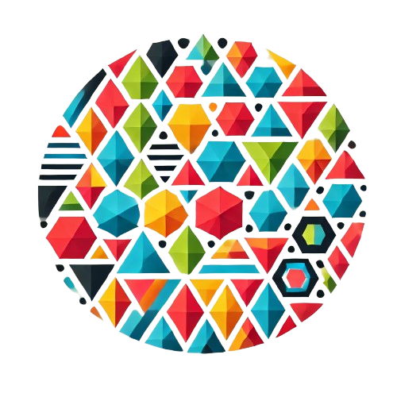

#  PolyDiM

**PolyDiM** (POLYtopal DIscretization Methods ) is a numerical computational library designed for solving partial differential equations (PDEs) using discretization methods that operate on generic polytopal (polygonal/polyhedral) meshes.

PolyDiM is inspired by and built upon the foundational research of the Numerical Analysis Group in the Department of Mathematical Sciences "Giuseppe Luigi Lagrange" (DISMA) at the Politecnico di Torino.

See the official documentation at the [official website](https://polydim.it/) for the main guide to install the library.

This file can be used by citing references in CITATION.cff file.

## Repository structure

The codebase is organized into three main blocks — the **meshes**, the **library** itself, and the **GeDiM** dependency (included as a submodule) — plus the build/configuration and license files.

Legend of the acronyms recurring in folder and class names:

- **FEM** – Finite Element Method (classical finite elements).
- **VEM** – Virtual Element Method (virtual elements on polygons/polyhedra).
- **ZFEM** – Zipped FEM variant on star-shaped polygonal elements.
- **PCC** – **primal conforming** formulation (H¹-conforming scalar/vector spaces).
- **MCC** – **mixed conforming** formulation (velocity-flux/pressure pairs, e.g. Raviart–Thomas).
- **DF_PCC** – **divergence-free**, primal conforming spaces, used for Stokes/Navier–Stokes-type problems.

---

### `Mesh/` — meshes

Collection of precomputed meshes used by the examples and tests as computational domains.
Files are in **CSV** format (`Cell0Ds`, `Cell1Ds`, `Cell2Ds`: vertices, edges, cells).

- **`Mesh/2D/`** — two-dimensional meshes of various kinds:
  - `GenericPolyMesh` — generic polygonal mesh.
  - `ConvexConcave` — meshes with convex and concave cells at several resolutions.
  - `StructuredConcave` — structured meshes with concave elements.
  - `AgglomeratedConcaveMesh` — agglomerated concave meshes.
  - `CircleTriangularMesh` — triangulations of the disk with successive refinements.
  - `CooksMembrane` — Voronoi meshes for the classic "Cook's membrane" test (elasticity).
  - `DarcyStokesMesh` — meshes for coupled Darcy–Stokes problems (quadrilateral and triangular, various sizes) used in the reference paper.
- **`Mesh/3D/`** — three-dimensional meshes:
  - `Hexaedron` — hexahedral meshes at increasing resolution.
  - `Tetra200` — tetrahedral mesh.
  - `Conformed` — conforming mesh.

Other mesh generators can be found in GeDiM at the path `PolyDiM/gedim/GeDiM/src/Mesh/MeshUtilities_MeshGenerators.cpp`. 

---

### `PolyDiM/` — Main library

Contains the library source code, application examples, unit tests, and the CMake
configuration/installation files.

#### `PolyDiM/src/` — Library source code

- **`Common/`** — shared definitions and compile-time macros (`Polydim_Macro.in`).

- **`Utilities/`** — basic numerical utilities shared by all methods: 1D/2D/3D monomials
  (`Monomials_*`), gradient bases (`GBasis_2D/3D`), and inertia-tensor utilities
  (`Inertia_Utilities`), used in the projections onto the local spaces.

- **`Interpolation/`** — polynomial interpolation, with the implementation of 1D Lagrange
  polynomials (`lagrange_1D`).

- **`FEM/`** — local spaces for classical **finite elements**:
  - `PCC/1D` — 1D primal conforming space.
  - `PCC/2D` — triangular and quadrilateral elements.
  - `PCC/3D` — tetrahedral and hexahedral elements.
  - `MCC/2D` — mixed triangular Raviart–Thomas (RT) elements.
  Each family defines a `ReferenceElement`, a `LocalSpace`, and the related `Creator`/`Data`.

- **`VEM/`** — the core of the library: local spaces for **virtual elements** on polygons/polyhedra:
  - `PCC/2D` and `PCC/3D` — primal conforming spaces, including the orthogonalized (`Ortho`)
    and inertia-based (`Inertia`) variants that improve conditioning.
  - `MCC/2D` and `MCC/3D` — mixed conforming spaces (velocity/pressure), with orthogonalized
    variants on edges and volume (`Ortho`, `EdgeOrtho`, `Partial`).
  - `DF_PCC/2D` and `DF_PCC/3D` — divergence-free spaces for velocity and pressure, in full
    and "reduced" (`Reduced`) versions.
  - `Quadrature/` — VEM-specific quadrature rules in 2D and 3D.
  Each family also provides `Utilities` and `PerformanceAnalysis` for performance measurements.

- **`ZFEM/`** — local spaces for the Zipped FEM variant (`ZFEM/PCC/2D`), with a structure
  analogous to FEM/VEM (ReferenceElement, LocalSpace, Creator, Utilities, PerformanceAnalysis).

- **`PDETools/`** — cross-cutting tools to assemble and solve the PDEs:
  - `Assembler/` — global assemblers (in particular for PCC 2D problems: elliptic, Stokes,
    Navier–Stokes, nonlinear) and related utilities.
  - `DOFs/` — degrees-of-freedom management (`DOFsManager`).
  - `Equations/` — definition of the model equations (e.g. `EllipticEquation`).
  - `LocalSpace/` — a uniform wrapper over the local spaces (PCC/MCC/DF_PCC in 2D/3D) that
    abstracts away the underlying discretization method.
  - `Mesh/` — utilities for mesh connectivity and interfacing with the GeDiM data structures.

#### `PolyDiM/examples/` — Application examples

Complete executable programs (`main.cpp` + a `src/` folder with assembler, configuration,
and test definition), each with an `integration_test.py` script for validation. They cover
a broad range of problems:

- `Elliptic_PCC_1D`, `Elliptic_PCC_2D`, `Elliptic_PCC_3D` — elliptic (diffusion) problems, primal formulation.
- `Elliptic_MCC_2D`, `Elliptic_MCC_3D` — the same problems in mixed formulation.
- `Elastic_PCC_2D` — 2D linear elasticity.
- `Stokes_DF_PCC_3D` — 3D Stokes problem with divergence-free spaces.
- `NavierStokes_DF_PCC_2D` — 2D Navier–Stokes (nonlinear).
- `Brinkman_DF_PCC_2D` — 2D Brinkman problem.
- `Parabolic_PCC_2D` — 2D parabolic (time-dependent) problem.
- `Parabolic_PCC_BulkFace_2D` — parabolic problem with bulk–face coupling.

#### `PolyDiM/test/` — Unit tests

Tests (GoogleTest) organized to mirror the sources: `FEM/`, `VEM/`, `ZFEM/`, `PDETools/`,
verifying the local spaces for each element type and the assemblers/DOF management. The
entry point is `main.cpp`.

#### `PolyDiM/cmake/`

Configuration files for exporting and installing the library (`PolyDiMConfig.cmake.in`),
enabling PolyDiM to be consumed as a CMake package (`find_package`).

---

### `gedim/` — GeDiM dependency (submodule)

Git submodule pointing to [AURION-Polito/gedim](https://github.com/AURION-Polito/gedim).
**GeDiM** (GEometry for DIscretization MEthods) is the foundational C++ library on which
PolyDiM is built: it provides the common geometrical operations in 1D/2D/3D, the mesh data
structures, quadrature rules, linear-algebra/solver interfaces, and I/O used by discretization
methods. It requires the **C++20** standard (gcc ≥ 10) and CMake ≥ 3.12. Initialize it with

```bash
git submodule init
git submodule update
```

Internal structure:

- **`gedim/GeDiM/src/`** — library source code, split into modules:
  - `Common/` — shared utilities and compile-time macros (`CommonUtilities`, `Gedim_Macro.in`).
  - `Algebra/` — linear-algebra abstractions and solver back-ends: dense/sparse arrays and
    interfaces (`IArray`, `ISparseArray`, `ILinearSolver`), an **Eigen** back-end (LU, Cholesky,
    PCG, BiCGSTAB), plus optional interfaces to **PETSc**, **Pardiso**, **SuiteSparse**, and
    **LAPACK**, and linear-programming utilities (`LPUtilities`).
  - `Geometry/` — geometric operations (`GeometryUtilities`: intersections, points, polygons,
    polyhedra, splitting/merging) and reference-element maps (triangle, quadrilateral,
    tetrahedron, hexahedron, parallelogram, parallelepiped).
  - `Mesh/` — mesh data structures and management: the DAO layer (`MeshMatrices`,
    `MeshMatricesDAO`, `IMeshDAO`), CSV import/export, mesh generators, refinement and
    conforming utilities (1D/2D/3D), mesh–segment/polygon/polyhedron intersection, Platonic
    solids, and interfaces to external formats (OpenVolumeMesh, Object File Format, regn/face, triangular meshes).
  - `Quadrature/` — Gauss and Gauss–Lobatto quadrature rules for segments, triangles, squares,
    tetrahedra, and hexahedra (including positive-weight variants).
  - `IO/` — input/output and configuration: text readers, configuration handling, string/time
    utilities, and exporters such as **VTK**, UCD, and MEDIT.
  - `MpiTools/` — parallel/MPI tools: MPI process environment, graph utilities, and a **METIS**
    interface for mesh partitioning.
- **`gedim/GeDiM/test/`** — GoogleTest unit tests mirroring the source modules (`Algebra`,
  `Geometry`, `Mesh`, `Quadrature`, `IO`, `MpiTools`), with sample test meshes.
- **`gedim/GeDiM/cmake/`** — CMake export/installation configuration for GeDiM.
- **`gedim/3rd_party_libraries/`** — CMake helpers to fetch and build the external dependencies
  (`InstallEigen3`, `InstallGTest`, `InstallLapack`, `InstallMetis`, `InstallTetgen`,
  `InstallTriangle`, `InstallVTK`, `InstallVoro`) plus the SuiteSparse config.
- **`gedim/cmake/`** — developer tooling: `clang-format`, `cppcheck`, and license-prepending scripts.
- **`gedim/external_dependencies.sh`** — helper that prints the `CMAKE_PREFIX_PATH` for the
  installed external libraries.
- Root files: `CMakeLists.txt`, `CITATION.cff`, `LICENSE` (**GPL-3.0**), `README.md`, and `gedim_logo.png`.

**Required external libraries:** Eigen, BLAS, LAPACK.
**Optional external libraries** (toggled via CMake flags such as `ENABLE_TRIANGLE`,
`ENABLE_TETGEN`, `ENABLE_VORO`, `ENABLE_METIS`, `ENABLE_VTK`): Triangle, TetGen, Voro++,
SuiteSparse, PETSc, METIS, VTK.

---
